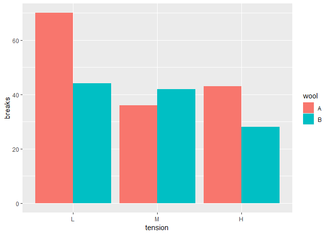

#Data Visualization with ggplot2 (Part 1)
*Course notes: week 4 assignment*  


```r
library(ggplot2)
```

## Introductory Information

There are two main kinds of plots:  
* **Exploratory plots:** data-heavy, generally the first step in visualizing your data  
  + Intended for a small audience (e.g. yourself)  
  + Used for analysing, exploring your data visually. LOOKING for something.  
* **Explanatory plots:** focused on more specific aspects of the data  
  + Intended for a broader audience (e.g. publication)  
  + Used for communicating and explaining results. SHOWING something. 

#### Basic ggplot syntax example:  
`ggplot(data, aes(x, y, other aesthetic = other variable)) + geom_point()`  
This will generate a basic scatterplot and can be used to generate ggplot objects. See below for more on the optional, other aesthetics you can map variables to when creating scatterplots.   
*If a variable is categorical but is classified as numeric, use `factor()` so that ggplot will treat it as a categorical variable.*  

#### Grammar of graphics
This course focuses on the three essential grammatical elements or layers of plots:  
1. *Data* : what you're plotting  
2. *Aesthetics* : what you map the data to in order to display it (e.g. x/y axis, color, size etc.)  
3. *Geometries* : what we use to display the data (e.g. points, lines, histograms)    
(The other elements are covered in later courses.)  


## Data

If you want to plot multiple groups of data, you should NOT just keep adding geoms with different aesthetics for each. Instead, you should map your groups to an aesthetic (e.g. color) and ggplot will then create a legend for you. To do this easily, the data should be set up with each observation in its own row, and each variable in its own column.  

For instance, my growth curve data currently looks like this once it's ready to plot:

```r
library(readxl)
growth_demo <- read_excel("C:/Users/Leah/Documents/Biol720/Growth_curve_sample.xlsx")
str(growth_demo)
```

```
## Classes 'tbl_df', 'tbl' and 'data.frame':	92 obs. of  4 variables:
##  $ Time                           : num  0 0.25 0.5 0.75 1 1.25 1.5 1.75 2 2.25 ...
##  $ Rm5000 infected                : num  0.066 0.0743 0.0787 0.0833 0.088 ...
##  $ RmP4321 (empty vector) infected: num  0.1363 0.094 0.0997 0.1063 0.1123 ...
##  $ Clone 2 (sma2245) infected     : num  0.109 0.111 0.119 0.126 0.134 ...
```

```r
head(growth_demo)
```

```
## # A tibble: 6 x 4
##    Time `Rm5000 infected` `RmP4321 (empty vector) ~ `Clone 2 (sma2245) in~
##   <dbl>             <dbl>                     <dbl>                  <dbl>
## 1  0               0.0660                    0.136                   0.109
## 2  0.25            0.0743                    0.0940                  0.111
## 3  0.5             0.0787                    0.0997                  0.119
## 4  0.75            0.0833                    0.106                   0.126
## 5  1               0.0880                    0.112                   0.134
## 6  1.25            0.0940                    0.120                   0.142
```

But for ease of ggplot plotting, each observation should be its own row--there should be a separate "strain" column, instead of each strain getting its own column for its optical density measurements.  


#### Useful tidyR commands for this:  
`gather()` : moves information from columns to rows--separates multiple columns into "key-value" pairs. You specify the categorical variable using "-", and the new names of the key and value columns generated (see example below).  
`separate()` : separates a column into multiple columns based on the separator you specify (see example below).  
`spread()` : moves a key value pair into multiple columns--the reverse of `gather()` (e.g. from DataCamp: Measure (length or width) with its associated value column will get spread into a length column and a width column).  

Using these commands on my growth curve data:  

```r
library(tidyr)
growth_demo.tidy <- gather(growth_demo, key = "Strain", value = "OD", -Time)
str(growth_demo.tidy)
```

```
## Classes 'tbl_df', 'tbl' and 'data.frame':	276 obs. of  3 variables:
##  $ Time  : num  0 0.25 0.5 0.75 1 1.25 1.5 1.75 2 2.25 ...
##  $ Strain: chr  "Rm5000 infected" "Rm5000 infected" "Rm5000 infected" "Rm5000 infected" ...
##  $ OD    : num  0.066 0.0743 0.0787 0.0833 0.088 ...
```

```r
head(growth_demo.tidy)
```

```
## # A tibble: 6 x 3
##    Time Strain              OD
##   <dbl> <chr>            <dbl>
## 1  0    Rm5000 infected 0.0660
## 2  0.25 Rm5000 infected 0.0743
## 3  0.5  Rm5000 infected 0.0787
## 4  0.75 Rm5000 infected 0.0833
## 5  1    Rm5000 infected 0.0880
## 6  1.25 Rm5000 infected 0.0940
```
Now each optical density observation for each strain at each timepoint has its own row!  

Here is another sample growth curve dataset, with observations for both phage-infected and uninfected strains. Currently I include the "infected status" with the strain name, but instead "status" (infected or not) should be its own column. I can do this with `separate()`:  

```r
growth_demo.2 <- read_excel("C:/Users/Leah/Documents/Biol720/Growth_curve_s2.xlsx")
str(growth_demo.2)
```

```
## Classes 'tbl_df', 'tbl' and 'data.frame':	92 obs. of  7 variables:
##  $ Time              : num  0 0.25 0.5 0.75 1 1.25 1.5 1.75 2 2.25 ...
##  $ Rm5000_infected   : num  0.066 0.0743 0.0787 0.0833 0.088 ...
##  $ RmP4321_infected  : num  0.1363 0.094 0.0997 0.1063 0.1123 ...
##  $ Clone2_infected   : num  0.109 0.111 0.119 0.126 0.134 ...
##  $ RmP4321_uninfected: num  0.1113 0.0933 0.0983 0.1053 0.1113 ...
##  $ Rm5000_uninfected : num  0.0677 0.0763 0.081 0.0867 0.0917 ...
##  $ Clone2_uninfected : num  0.143 0.116 0.121 0.128 0.136 ...
```

```r
head(growth_demo.2)
```

```
## # A tibble: 6 x 7
##    Time Rm5000_infected RmP4321_infected Clone2_infected RmP4321_uninfec~
##   <dbl>           <dbl>            <dbl>           <dbl>            <dbl>
## 1  0             0.0660           0.136            0.109           0.111 
## 2  0.25          0.0743           0.0940           0.111           0.0933
## 3  0.5           0.0787           0.0997           0.119           0.0983
## 4  0.75          0.0833           0.106            0.126           0.105 
## 5  1             0.0880           0.112            0.134           0.111 
## 6  1.25          0.0940           0.120            0.142           0.118 
## # ... with 2 more variables: Rm5000_uninfected <dbl>,
## #   Clone2_uninfected <dbl>
```

```r
growth_demo.2tidy <- growth_demo.2 %>%
  gather(key = "Strain", value = "OD", -Time) %>%
  separate(col = Strain, into = c("Strain", "Status"), sep = "_")
str(growth_demo.2tidy)
```

```
## Classes 'tbl_df', 'tbl' and 'data.frame':	552 obs. of  4 variables:
##  $ Time  : num  0 0.25 0.5 0.75 1 1.25 1.5 1.75 2 2.25 ...
##  $ Strain: chr  "Rm5000" "Rm5000" "Rm5000" "Rm5000" ...
##  $ Status: chr  "infected" "infected" "infected" "infected" ...
##  $ OD    : num  0.066 0.0743 0.0787 0.0833 0.088 ...
```

```r
head(growth_demo.2tidy)
```

```
## # A tibble: 6 x 4
##    Time Strain Status       OD
##   <dbl> <chr>  <chr>     <dbl>
## 1  0    Rm5000 infected 0.0660
## 2  0.25 Rm5000 infected 0.0743
## 3  0.5  Rm5000 infected 0.0787
## 4  0.75 Rm5000 infected 0.0833
## 5  1    Rm5000 infected 0.0880
## 6  1.25 Rm5000 infected 0.0940
```

Wow! That was surprisingly easy. 

##Aesthetics  

You map variables (COLUMNS) to visible aesthetics. That's why it's good to have one column per variable--makes making plots easier.  
Aesthetics are **not** attributes. Attributes you call in the geom layer to change the look of the entire plot, without considering different variables. Be careful-- **attributes can overwrite aesthetics!** (e.g. `+ geom_point(color = "red")` will make all points red, even if you mapped a certain variable to color using `aes`.)  

#### Aesthetics/attributes used for scatterplots: 
`x`  
`y`  
`color`  (can use rcolorbrewer package for nice colour schemes)  
`size`  
`alpha` (transparency, where 1 = completely opaque, 0 = transparent)  
`linetype` (dashing pattern)  
`fill` (used for shapes 21-25, which have both color and fill. Others only have color aesthetic.)  
`shape` (categorical only)  
`label` (categorical only)  


#### Dealing with overplotting
Some options if your dataset is large/there is a lot of datapoint overlap:  
1. Use hollow/smaller shapes  
2. Lower the alpha value (increase transparency)  
3. Set a jitter. There are numerous ways to do this:  
  + Use `geom_jitter()` instead of `geom_point()`  
  + Set: `geom_point(position = "jitter")`   
  + Use position_jitter function. E.g. `posn <- position_jitter(width)` Then: `geom_point(position = posn)`. This allows you to specify the width of jitter you want, and to easily use that jitter consistently across multiple plots.  
  
## Geometries  
#### Geoms mentioned in the course:  
* `geom_point()` : for scatterplots. Use `geom_jitter()` wrapper to set a jitter.  
* `geom_smooth()` : fits a curve based on data (e.g. linear model)  
* `geom_vline()` and `geom_hline()`: plots vertical/horizontal lines. Note that these do not inherit aesthetics and need their own specified.  
* `geom_histogram()` : historgrams. Can specify binwidth, bar positions. Generates an internal dataframe which you can call with .. (e.g. `..count..`, `..density..`)  
* `geom_freqpoly()` : frequency polygons--a variation on the histogram.  
* `geom_bar()`: bar graphs.   
* `geom_line()` : line plots.  
* `geom_area()` : like geom_line, but with stacked area plots instead.  
* `geom_ribbon()` : for overlapping area plots  
* `geom_rect()` : draws rectangles  

####Scatterplot examples:  
Made using the built-in msleep dataset (data on sleep habits of various mammals)  
**Fitting a linear model:** use `geom_smooth(method = "lm")`. Can also specify `se = TRUE/FALSE` (display confidence interval around smooth)  


```r
ggplot(msleep, aes(x = bodywt, y = sleep_total, color = vore)) + geom_point(alpha = 0.9) + geom_smooth(method = "lm", se = FALSE) + scale_x_log10() + labs(title = "Total sleep hours vs bodyweight")
```

<!-- -->
  
Note that by default, `geom_smooth()` takes group aesthetics specified by the ggplot aes--so it gives a line for each colour group. If you only want one line, you could use:  

```r
ggplot(msleep, aes(x = bodywt, y = sleep_total, color = vore)) + geom_point(alpha = 0.9) + geom_smooth(inherit.aes = FALSE, aes(x = bodywt, y = sleep_total), method = "lm", se = FALSE, colour = "grey") + scale_x_log10() + labs(title = "Total sleep hours vs bodyweight")
```

<!-- -->
  
#### Histogram and bar plot examples:   
Made using the `chickwts` dataset (chicken weights by feed type)  
**Basic histogram:**  


```r
ggplot(chickwts, aes(x = weight)) + geom_histogram(binwidth = 20) +labs(title = "Distribution of chicken weights")
```

<!-- -->
   

**Fill histogram, with feed type mapped to colour:** 

```r
ggplot(chickwts, aes(x = weight, fill = feed)) + geom_histogram(binwidth = 20, position = "fill") + ylab("Proportion") + labs(title = "Distribution of chicken weights by feed type")  
```

<!-- -->
  
**Basic bar plot**:  
Made using the `warpbreaks` dataset, which contains data on the number of breaks in yarn when weaving (under low, medium, and high tension)  
To get the bars to represent their actual values instead of counts of the values, need to set stat = "identity".   


```r
ggplot(warpbreaks, aes(x = tension, y = breaks, fill = wool )) + geom_bar(stat = "identity", position = "dodge")
```

<!-- -->


####Line plot examples:  
(Using tidied growth curve data from above)  
**Basic line plot with multiple time series:** 

```r
ggplot(growth_demo.tidy, aes(x = Time, y = OD, color = Strain)) + geom_line() + scale_y_log10(name = "Optical Density (OD600)") + xlab( "Time (hrs)")
```

<!-- -->

**Line plot with multiple time series and additional aesthetic mapping. I've also put a rectangle around the first five hours for emphasis:**  
Maybe a bit ugly/hard to read, but a good demonstration of what was covered in the course.  
Note the separate attributes/aesthetics set for each geom layer.  

```r
ggplot(growth_demo.2tidy, aes(x = Time, y = OD, color = Strain, linetype = Status)) + geom_line(size = 1.5) + scale_y_log10(name = "Optical Density (OD600)") + xlab( "Time (hrs)") + labs(title = "Demo Growth Curve: Phage 5A Infection") + geom_rect(alpha = 0, colour = "red", show.legend = FALSE, aes(xmin = 0, xmax = 5, ymin = 0.03, ymax = 0.3))
```

<!-- -->

