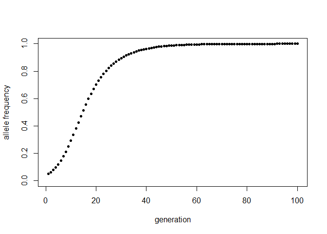
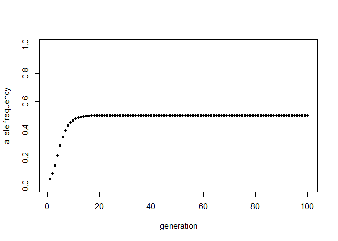
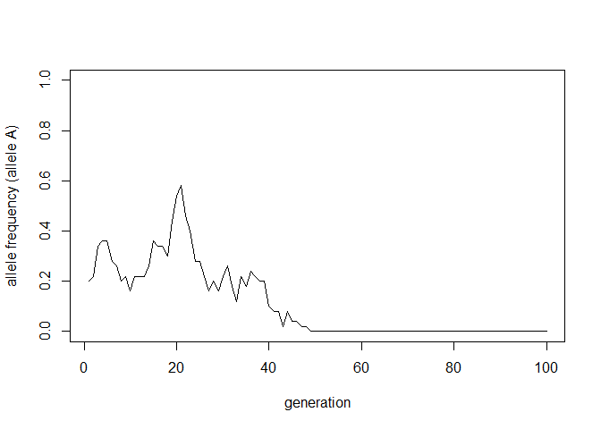
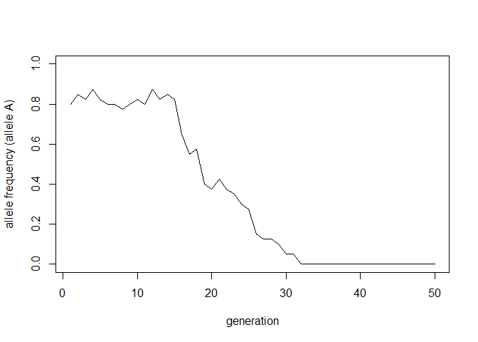
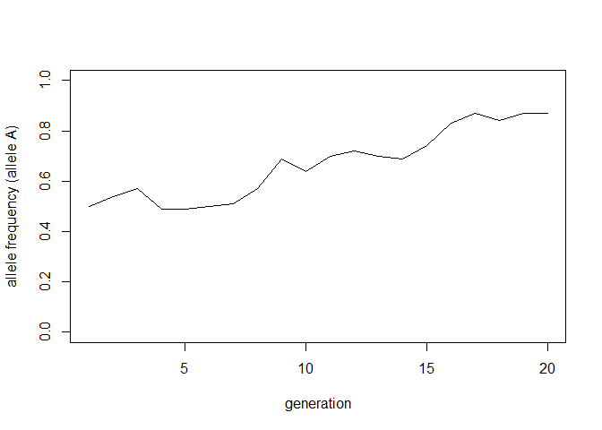
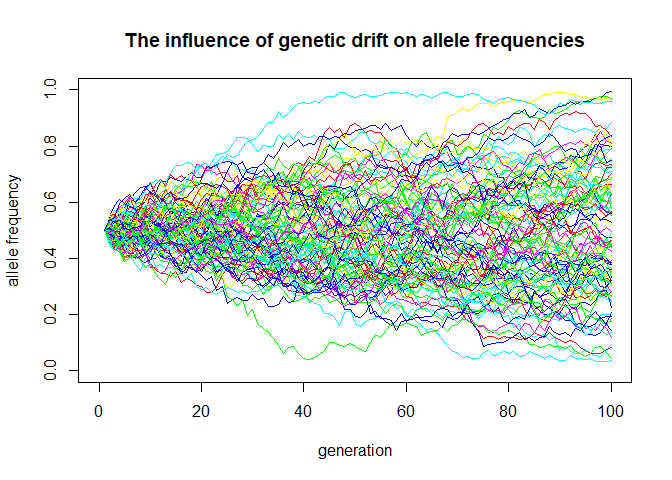
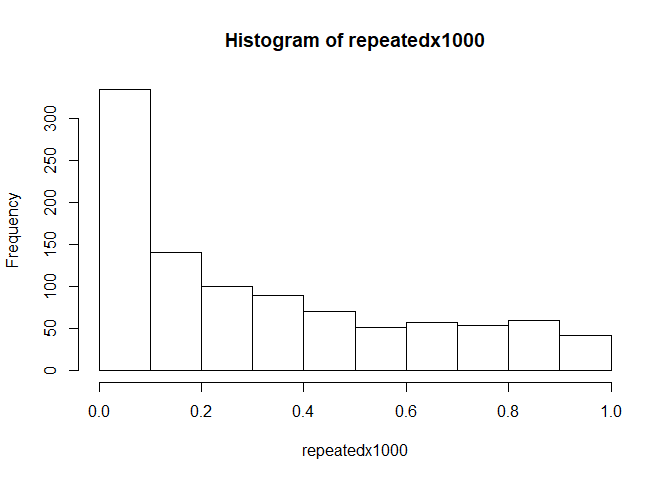
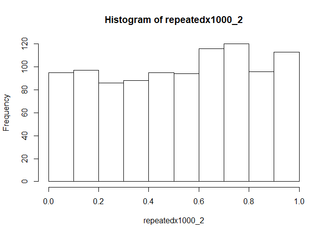
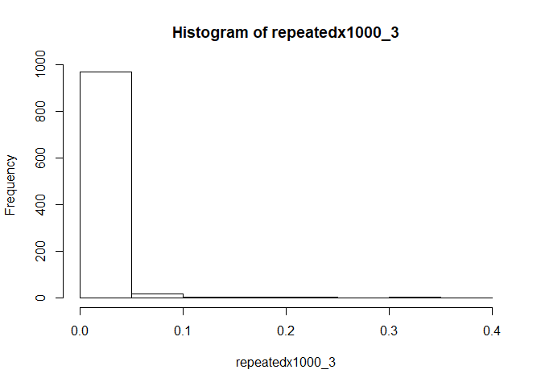
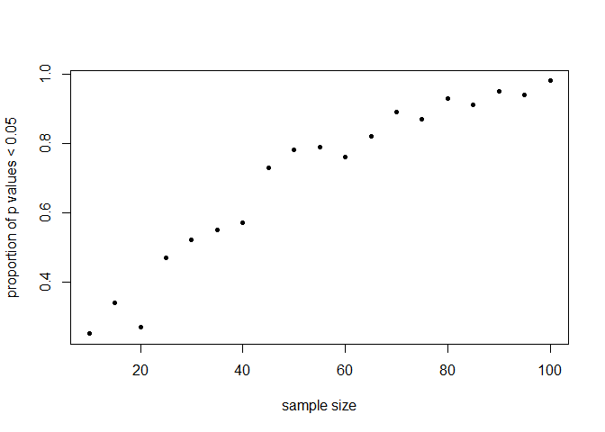

#### Question 2  
**Diploid selection simulator**  
Where:  
*p0 = frequency of allele A at time 0*  
*w1, w2, w3 = fitnesses for genotypes AA, Aa, and aa, respectively*  
*n = number of generations*  


```r
diploid_selection <- function(p0, w1, w2, w3, n) {
  #Initialize vectors
  p <- rep(NA, n)
  w_bar <- rep(NA, n)
  
  #Starting conditions
  p[1] <- p0
  w_bar[1] <- ((p[1]^2)*w1) + (2*p[1]*(1-p[1])*w2) + (((1-p[1])^2)*w3)
  
  #Loop generation to generation
  for (i in 2:n) {
    w_bar[i-1] <- ((p[i-1]^2)*w1) + (2*p[i-1]*(1-p[i-1])*w2) + (((1-p[i-1])^2)*w3)
    p[i] <- ((p[i-1]^2)*(w1/w_bar[i-1])) + (p[i-1]*(1-p[i-1])*(w2/w_bar[i-1]))
  }
  
  #Plot allele frequency
  generations <- 1:length(p)
  plot(p ~ generations, pch = 20,
       ylab = "allele frequency",
       xlab = "generation",
       ylim = c(0, 1))
  
  #Fixation messages
  if (any(p > 0.9999)) {
    fixation <- min(which.max(p > 0.9999)) #isn't using min here redundant? 
    cat("Fixation for allele A occurs approximately at generation", fixation)
  } else if (any(p < 0.0001)) { #if other allele fixes. Although the assumption is that allele A is the beneficial one
    fixation <- min(which.max(p < 0.0001))
    cat("Fixation for the other allele (a) occurs approximately at generation", fixation)
  } else {
    maxAlleleFreq <- max(p)
    cat("Fixation does not occur. Maximum allele frequency of allele A is", maxAlleleFreq)
  }
}
#testing
diploid_selection(0.05, 1, 0.9, 0.7, 100)
```

<!-- -->

```
## Fixation for allele A occurs approximately at generation 96
```

```r
diploid_selection(0.05, 0.5, 1, 0.5, 100)
```

<!-- -->

```
## Fixation does not occur. Maximum allele frequency of allele A is 0.5
```

#### Question 3  
**Genetic drift simulator**  
Where:  
*n_alleles = total number of alleles (e.g. 2 \* individuals for diploid organisms)*  
*p0 = frequency of allele A at time 0*  
*n = number of generations*  


```r
drift <- function(n_alleles, p0, n) {
  
  #Initialize frequency vector
  allele_freq <- rep(NA, n)
  
  #Starting condition 
  allele_freq[1] <- p0
  
  #Loop over generations.
  for (i in 2:n) {
   allele_count <- sample(c("A", "a"), 
    size = n_alleles, 
    replace = TRUE, 
    prob = c(allele_freq[i-1], (1 - allele_freq[i-1])))
    allele_freq[i] <- sum(allele_count == "A")/n_alleles
  }
  
  #Plot allele frequency over time
  generations <- 1:n
  plot(allele_freq ~ generations, type = "l",
       ylab = "allele frequency (allele A)",
       xlab = "generation",
       ylim = c(0, 1))
  
  
  
  #Message ADD SOMETHING HERE? E.G FIXATION?
  if (any(allele_freq == 0)) {
    loss<- min(which.max(allele_freq == 0)) #isn't using min here redundant? 
    cat("The allele A was lost from the population at generation", loss)
  } else if (any(allele_freq == 1)){
    fix <- min(which.max(allele_freq == 1))
    cat("The allele A was fixed in the population at generation", fix)
  } else {
    cat("Frequency of allele A is", allele_freq[n], "after", n, "generations")
  }
  #return(allele_freq) #Optional line to show frequency for each generation
}

drift(50, 0.2, 100)
```

<!-- -->

```
## The allele A was lost from the population at generation 49
```

```r
drift(40, 0.8, 50)
```

<!-- -->

```
## The allele A was lost from the population at generation 32
```

```r
drift(100, 0.5, 20)
```

<!-- -->

```
## Frequency of allele A is 0.87 after 20 generations
```

#### Question 4  
**Repeating the genetic drift simulation**  
This function returns the proportion of runs that resulted in loss of the A allele.  
Where:  
*reps = number of repititions of the genetic drift simulation*  
*See drift function above for definitions of other arguments*  


```r
drift_rep <- function(n_alleles, p0, n, reps) {
  
  
  #Initialize frequency vector
  allele_freq <- rep(NA, n)
  
  #Starting conditions
  allele_freq[1] <- p0
  loss_count <- 0
  
  for (j in 1:reps) {
    for (i in 2:n) {
      allele_count <- sample(c("A", "a"), 
                      size = n_alleles, 
                      replace = TRUE, 
                      prob = c(allele_freq[i-1], (1 - allele_freq[i-1])))
      allele_freq[i] <- sum(allele_count == "A")/n_alleles
        }
      if (any(allele_freq == 0)) {
      loss_count <- loss_count + 1
      }
  }
return(loss_count/reps)
  }

drift_rep(400, 0.5, 100, 1000)
```

```
## [1] 0.007
```

```r
drift_rep(400, 0.25, 100, 1000)
```

```
## [1] 0.109
```

```r
drift_rep(400, 0.1, 100, 1000)
```

```
## [1] 0.425
```

#### Question 5  
**Plotting genetic drift**  

```r
drift_rep_plotter <- function(n_alleles, p0, n, reps) {


  #Generate a blank plot:
  plot(x = 1, y = 0, type = "n",
     main = "The influence of genetic drift on allele frequencies", 
     xlab = "generation", 
     ylab = "allele frequency", 
     xlim = c(0, n),
     ylim = c(0, 1))
  generations <- 1:n
  
  #Initialize frequency vector
  allele_freq <- rep(NA, n)
  
  #Starting conditions
  allele_freq[1] <- p0
  
#Do I need to store all the allele frequencies for every rep?
  for (j in 1:reps) {
    for (i in 2:n) {
      allele_count <- sample(c("A", "a"), 
                            size = n_alleles, 
                            replace = TRUE, 
                            prob = c(allele_freq[i-1], (1 - allele_freq[i-1])))
      allele_freq[i] <- sum(allele_count == "A")/n_alleles
      }
  lines(x = generations, y = allele_freq, type = "l", col = sample(rainbow(6), 1))
  }
}

drift_rep_plotter(400, 0.5, 100, 100)
```

<!-- -->


#### Question 6  

**Rewriting the data simulation as a function**  

```r
data_sim <- function(n, a, b, rse) {
  x <- seq(from = 1, to = 20, length.out = n)
  y_deterministic <- a + b*x
  #set.seed(42) #Allowing for check against sample code
  y_simulated <- rnorm(length(x), mean = y_deterministic, sd = rse)
  
  mod_sim <- lm(y_simulated ~ x)
  p_val_slope <- summary(mod_sim)$coef[2,4]
  return(p_val_slope)
}

data_sim(20, 0.5, 0.1, 2)
```

```
## [1] 0.2052872
```

**Checking that the function works like the given example**  
Use set.seed():  

```r
#Checking with sample code from assignment:
x <- seq(from = 1, to = 20, length.out = 20)
a <- 0.5
b <- 0.1
y_deterministic <- a + b*x
set.seed(42) #Specify seed
y_simulated <- rnorm(length(x), mean = y_deterministic, sd = 2)

mod_sim <- lm(y_simulated ~ x)
p_val_slope2 <- summary(mod_sim)$coef[2,4]
p_val_slope2
```

```
## [1] 0.5653015
```

```r
#Use set.seed() to specify same seed for each random sampling--will generate same set of random numbers each time. Then compare the two outputs.
set.seed(42)
p_val_slope2 == data_sim(20, 0.5, 0.1, 2)
```

```
## [1] TRUE
```

When using the same series of pseudorandom numbers, the two methods give the same results (as they should).  

**Repeating it 1000 times**  

```r
repeatedx1000 <- rep(NA, 1000)
repeatedx1000 <- replicate(1000, data_sim(20, 0.5, 0.1, 2))

#Histogram of p values
hist(repeatedx1000)
```

<!-- -->

```r
#Proportion under p = 0.05
sum(repeatedx1000 < 0.05)/length(repeatedx1000)
```

```
## [1] 0.228
```

**Repeating the above with slope = 0**  


```r
repeatedx1000_2 <- rep(NA, 1000)
repeatedx1000_2 <- replicate(1000, data_sim(20, 0.5, 0, 2))
hist(repeatedx1000_2)
```

<!-- -->

```r
sum(repeatedx1000_2 < 0.05)/length(repeatedx1000_2)
```

```
## [1] 0.047
```

There is a much smaller proportion of significant p values (p < 0.05) when slope = 0 compared to when the slope = 0.1. When slope = 0, the histogram of the p values is mostly flat—-there are about equal occurrences of any range of p values--whereas with slope = 0.1, there was a higher frequency of low p values compared to others.  
This makes sense, because when slope = 0 there is no linear relationship between x and y and thus we should not detect a "significant"" linear relationship (p < 0.05) very frequently compared to any other p value. When the underlying relationship is linear (e.g. when slope = 0.1), we should expect and hope to detect a significant linear relationship more frequently, since the linear model fits the underlying relationship.  
With a greater slope (i.e. larger effect of x on y), we expect to detect a significant linear relationship between x and y even more frequently. Indeed, the simulation below with slope = 0.3 shows a much higher proportion of p values < 0.5 compared to the slope = 0.1 simulation. Thus size of the effect of x on y affects the statistical power of the model.

**With a more pronounced slope**  

```r
repeatedx1000_3 <- rep(NA, 1000)
repeatedx1000_3 <- replicate(1000, data_sim(20, 0.5, 0.3, 2))
hist(repeatedx1000_3)
```

<!-- -->

```r
sum(repeatedx1000_3 < 0.05)/length(repeatedx1000_3)
```

```
## [1] 0.966
```


**Testing different sample sizes**  


```r
sample_sizes <- seq(from = 10, to = 100, by = 5)
p_val_prop <- rep(NA, length(sample_sizes))
rep100 <- rep(NA, 100)
for (i in 1:length(sample_sizes)) {
  rep100 <- replicate(100, data_sim(sample_sizes[i], 0.5, 0.1, 1.5))
  p_val_prop[i] <- sum(rep100 < 0.05)/length(rep100)
}
names(p_val_prop) <- sample_sizes
p_val_prop
```

```
##   10   15   20   25   30   35   40   45   50   55   60   65   70   75   80 
## 0.25 0.34 0.27 0.47 0.52 0.55 0.57 0.73 0.78 0.79 0.76 0.82 0.89 0.87 0.93 
##   85   90   95  100 
## 0.91 0.95 0.94 0.98
```

```r
#Or, in matrix format 
p_val_prop_matrix <- cbind(sample_sizes, p_val_prop)
p_val_prop_matrix
```

```
##     sample_sizes p_val_prop
## 10            10       0.25
## 15            15       0.34
## 20            20       0.27
## 25            25       0.47
## 30            30       0.52
## 35            35       0.55
## 40            40       0.57
## 45            45       0.73
## 50            50       0.78
## 55            55       0.79
## 60            60       0.76
## 65            65       0.82
## 70            70       0.89
## 75            75       0.87
## 80            80       0.93
## 85            85       0.91
## 90            90       0.95
## 95            95       0.94
## 100          100       0.98
```

```r
#Plotting
plot(p_val_prop ~ sample_sizes, pch = 20,
     xlab = "sample size",
     ylab = "proportion of p values < 0.05")
```

<!-- -->

Larger sample sizes are more likely to give significant p values (p < 0.05). A larger sample size therefore gives the model more statistical power--we are less likely to fail to detect (p >= 0.05) the underlying relationship between x and y.  
